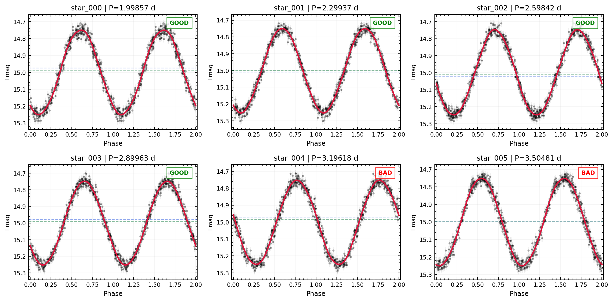

export const quartoRawHtml =
[`<div><style>
.dataframe > thead > tr,
.dataframe > tbody > tr {
  text-align: right;
  white-space: pre-wrap;
}
</style>
<small>shape: (6, 4)</small>`,`
<table class="dataframe" data-quarto-postprocess="true" data-border="1">
<thead>
<tr>
<th data-quarto-table-cell-role="th">timeseries_id</th>
<th data-quarto-table-cell-role="th">best_period</th>
<th data-quarto-table-cell-role="th">n_candidates</th>
<th data-quarto-table-cell-role="th">status</th>
</tr>
<tr>
<th>str</th>
<th>f64</th>
<th>i64</th>
<th>str</th>
</tr>
</thead>
<tbody>
<tr>
<td>"unknown"</td>
<td>1.998568</td>
<td>20</td>
<td>"GOOD"</td>
</tr>
<tr>
<td>"unknown"</td>
<td>2.299374</td>
<td>20</td>
<td>"GOOD"</td>
</tr>
<tr>
<td>"unknown"</td>
<td>2.598417</td>
<td>20</td>
<td>"GOOD"</td>
</tr>
<tr>
<td>"unknown"</td>
<td>2.899632</td>
<td>20</td>
<td>"GOOD"</td>
</tr>
<tr>
<td>"unknown"</td>
<td>3.19618</td>
<td>20</td>
<td>"BAD"</td>
</tr>
<tr>
<td>"unknown"</td>
<td>3.504806</td>
<td>20</td>
<td>"BAD"</td>
</tr>
</tbody>
</table>
`,`</div>`];

# Batch Workflows with TestGroup

`TestGroup` holds labelled collections of objects (GOOD / BAD / ANY) so
you can clean, analyse, and visualise many stars with one call instead
of a manual loop.


```python
from varistar import TimeSeries, LightCurve, TestGroup
from _synthetic import make_sinusoidal_lightcurve

lightcurves = []
for i, seed in enumerate([1, 2, 3, 4, 5, 6]):
    df = make_sinusoidal_lightcurve(period=2.0 + 0.3 * i, seed=seed)
    ts = TimeSeries(magnitude="mag I", time_scale="HJD")
    ts.load_data_from_df(df, data_id=f"star_{i:03d}")
    ts.clean_by_error(max_error=0.05)
    lightcurves.append(LightCurve(ts))

group = TestGroup(good_ts=lightcurves[:4], bad_ts=lightcurves[4:], name="synthetic_sample")
group.summary()
```

``` text
[clean_by_error] Removed 0 points (err > 0.05).
[clean_by_error] Removed 0 points (err > 0.05).
[clean_by_error] Removed 0 points (err > 0.05).
[clean_by_error] Removed 0 points (err > 0.05).
[clean_by_error] Removed 0 points (err > 0.05).
[clean_by_error] Removed 0 points (err > 0.05).
TestGroup 'synthetic_sample'  |  GOOD: 4  BAD: 2  ANY/LC: 0  (total: 6)
```

## Bulk period-finding

`apply()` calls an *unbound* method on every registered object.
`find_best_period` also fills in `is_harmonic`, which we’ll use below:


```python
group.apply(LightCurve.find_best_period)
```

## Mosaic view


```python
group.plot_mosaic(LightCurve.plot_phased, n_cols=3, fit_model="fourier")
```



## Filtering and export


```python
short_period = group.filter_by("periods", lambda p: p[0] < 3.0, target="any")
short_period.summary()
```

``` text
TestGroup 'synthetic_sample[filtered]'  |  GOOD: 0  BAD: 0  ANY/LC: 4  (total: 4)
```


```python
group.export_periods()
```

<div dangerouslySetInnerHTML={{ __html: quartoRawHtml[0] }} />

<div dangerouslySetInnerHTML={{ __html: quartoRawHtml[1] }} />

<div dangerouslySetInnerHTML={{ __html: quartoRawHtml[2] }} />

**Next:** [ML Feature Pipeline](./ml-features).
