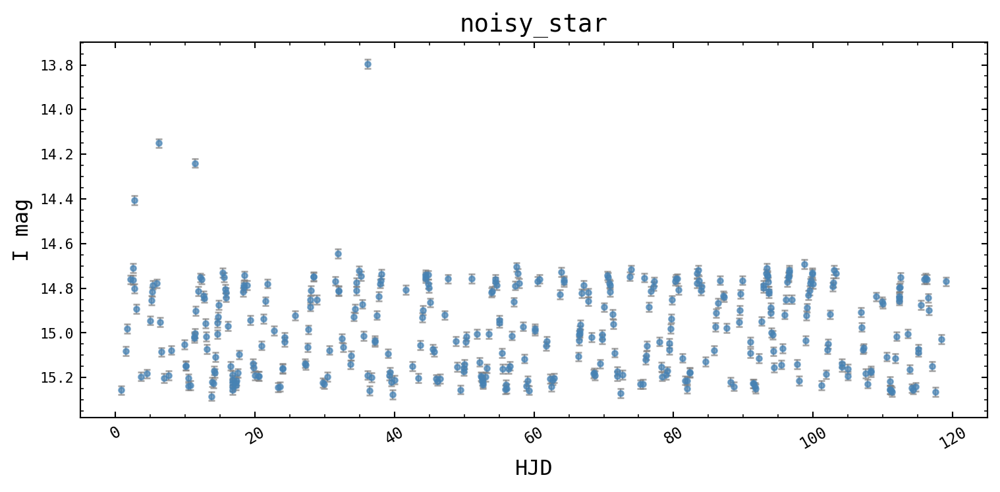
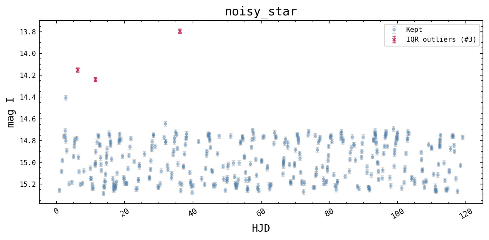

# Cleaning & Statistics

`TimeSeries` provides masking, clipping, binning, and summary-statistics
helpers. The masking functions (`mask_iqr_outliers`, `mask_sigma_clip`)
return a boolean mask without touching the data — you decide whether to
`apply_mask()`.


```python
import numpy as np
from varistar import TimeSeries
from _synthetic import make_sinusoidal_lightcurve

df = make_sinusoidal_lightcurve()

# Inject a few bad points so cleaning has something to do
rng = np.random.default_rng(0)
bad_idx = rng.choice(len(df), size=8, replace=False)
df.loc[bad_idx, "mag_i"] += rng.normal(0, 0.6, size=8)

ts = TimeSeries(magnitude="mag I", time_scale="HJD")
ts.load_data_from_df(df, data_id="noisy_star")
ts.plot_timeseries()
```



## Flagging and visualising outliers


```python
original_df = ts.timeseries_df  # keep a reference before filtering

mask = ts.mask_iqr_outliers(k=1.5)
ts.plot_cleaned(original_df, mask, labels=["IQR outliers"])
```



## Removing them


```python
ts.apply_mask(mask)
ts.clean_by_error(max_error=0.05)
ts.bin_data(time_window=0.5)
```

``` text
[clean_by_error] Removed 0 points (err > 0.05).
[bin_data] 397 → 194 points (window=0.5 d).
```

## Descriptive statistics


```python
ts.summary()
ts.get_cadence()
```

``` text
[noisy_star]  n=194  baseline=118.2 d  <mag>=14.997  amp=0.614
```

``` text
{'median_cadence': 0.5166288341175083,
 'min_cadence': 0.10011108495600496,
 'max_cadence': 2.2147086170233337}
```


```python
ts.stats()
```

``` text
{'mag_i': {'count': 194,
  'mean': 14.99734503942544,
  'std': 0.17926533609494374,
  'min': 14.669486907944208,
  'max': 15.283295080952254,
  'median': 15.01431826440474},
 'm_error': {'count': 194,
  'mean': 0.015487913840786004,
  'std': 0.00387273852671853,
  'min': 0.007559289460184544,
  'max': 0.02,
  'median': 0.01414213562373095}}
```

`mask_sigma_clip(column, n_sigma)` is a non-destructive alternative — it
returns a cleaned copy without touching `timeseries_df`, useful when you
want a clean view without committing to it.

**Next:** [Period Finding](./period-finding).
