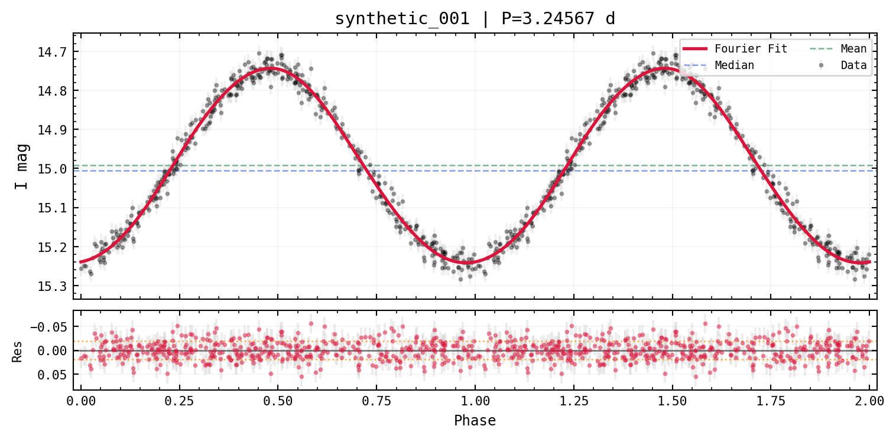

# varistar

**varistar** manages and analyzes timeseries and lightcurve photometry
for variable stars, coming from multiple survey sources (OGLE, TESS,
Gaia DR3, or your own CSV/arrays).

## Install


```bash
pip install varistar
# or
uv add varistar
```

## Quickstart

Every workflow starts the same way: load photometry into a `TimeSeries`,
wrap it in a `LightCurve`, and let `find_best_period` + `plot_best` do
the heavy lifting.


```python
from varistar import TimeSeries, LightCurve

# Using synthetic data here so this page runs standalone --
# see "Loading Data" for real survey files.
from _synthetic import make_sinusoidal_lightcurve

ts = TimeSeries(magnitude="mag I", time_scale="HJD")
ts.load_data_from_df(make_sinusoidal_lightcurve(), data_id="synthetic_001")

lc = LightCurve(ts)
lc.find_best_period()
lc.plot_best()
```



## Where to go next

- **[Loading Data](./loading-data)** — OGLE `.dat`, TESS, Gaia DR3, and
  plain CSV/arrays.
- **[Cleaning & Statistics](./cleaning-stats)** — outlier removal,
  binning, descriptive stats.
- **[Period Finding](./period-finding)** — Lomb-Scargle, PDM, PDM2,
  Spectrum Resampling.
- **[Phase Folding & Models](./phase-folding)** — Fourier and Gaussian
  model fits.
- **[Classification](./classification)** — variability indices and
  eclipsing-binary detection.
- **[Batch Workflows](./batch-testgroup)** — `TestGroup` for many stars
  at once.
- **[ML Feature Pipeline](./ml-features)** — feature extraction and
  clustering.
- **[Visualization](./visualization)** — publication styling and
  interactive plots.
- **[API Reference](./api-reference)**
