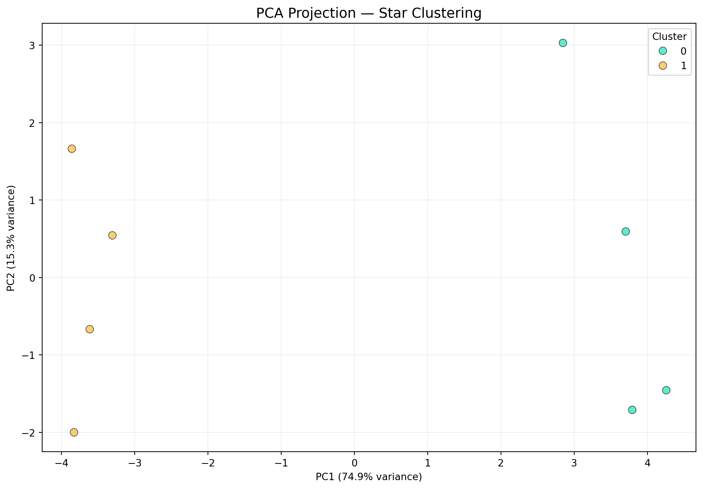

export const quartoRawHtml =
[`<div>
<style scoped>
    .dataframe tbody tr th:only-of-type {
        vertical-align: middle;
    }
    .dataframe tbody tr th {
        vertical-align: top;
    }
    .dataframe thead th {
        text-align: right;
    }
</style>
`,`
<table class="dataframe" data-quarto-postprocess="true" data-border="1">
<thead>
<tr style="text-align: right;">
<th data-quarto-table-cell-role="th"></th>
<th data-quarto-table-cell-role="th">median</th>
<th data-quarto-table-cell-role="th">mad</th>
<th data-quarto-table-cell-role="th">octile_skew</th>
<th data-quarto-table-cell-role="th">low</th>
<th data-quarto-table-cell-role="th">row</th>
<th data-quarto-table-cell-role="th">mav</th>
<th data-quarto-table-cell-role="th">skew</th>
<th data-quarto-table-cell-role="th">stetson_j</th>
<th data-quarto-table-cell-role="th">flux_perc_ratio</th>
<th data-quarto-table-cell-role="th">log_freq</th>
<th data-quarto-table-cell-role="th">log_amp</th>
<th data-quarto-table-cell-role="th">r21</th>
<th data-quarto-table-cell-role="th">ph21_cos</th>
<th data-quarto-table-cell-role="th">ph21_sin</th>
<th data-quarto-table-cell-role="th">freq_ratio</th>
<th data-quarto-table-cell-role="th">von_neumann</th>
<th data-quarto-table-cell-role="th">kurtosis</th>
<th data-quarto-table-cell-role="th">beyond1std</th>
</tr>
<tr>
<th data-quarto-table-cell-role="th">id</th>
<th data-quarto-table-cell-role="th"></th>
<th data-quarto-table-cell-role="th"></th>
<th data-quarto-table-cell-role="th"></th>
<th data-quarto-table-cell-role="th"></th>
<th data-quarto-table-cell-role="th"></th>
<th data-quarto-table-cell-role="th"></th>
<th data-quarto-table-cell-role="th"></th>
<th data-quarto-table-cell-role="th"></th>
<th data-quarto-table-cell-role="th"></th>
<th data-quarto-table-cell-role="th"></th>
<th data-quarto-table-cell-role="th"></th>
<th data-quarto-table-cell-role="th"></th>
<th data-quarto-table-cell-role="th"></th>
<th data-quarto-table-cell-role="th"></th>
<th data-quarto-table-cell-role="th"></th>
<th data-quarto-table-cell-role="th"></th>
<th data-quarto-table-cell-role="th"></th>
<th data-quarto-table-cell-role="th"></th>
</tr>
</thead>
<tbody>
<tr>
<td data-quarto-table-cell-role="th">sine_00</td>
<td>14.951740</td>
<td>0.166829</td>
<td>0.189136</td>
<td>0.193654</td>
<td>0.240996</td>
<td>0.348094</td>
<td>0.201077</td>
<td>0.309150</td>
<td>3.281441</td>
<td>-0.175862</td>
<td>-0.240124</td>
<td>0.006874</td>
<td>0.660781</td>
<td>-0.750578</td>
<td>0.998747</td>
<td>1.288633</td>
<td>-1.449550</td>
<td>0.472500</td>
</tr>
<tr>
<td data-quarto-table-cell-role="th">sine_01</td>
<td>15.022269</td>
<td>0.183528</td>
<td>-0.098277</td>
<td>0.213774</td>
<td>0.162972</td>
<td>0.222661</td>
<td>-0.099757</td>
<td>0.474463</td>
<td>3.279984</td>
<td>-0.278745</td>
<td>-0.232032</td>
<td>0.003478</td>
<td>0.551693</td>
<td>-0.834047</td>
<td>0.998408</td>
<td>0.921233</td>
<td>-1.496527</td>
<td>0.510000</td>
</tr>
<tr>
<td data-quarto-table-cell-role="th">sine_02</td>
<td>14.977564</td>
<td>0.167837</td>
<td>0.078717</td>
<td>0.192879</td>
<td>0.237459</td>
<td>0.227769</td>
<td>0.098007</td>
<td>0.503178</td>
<td>3.471829</td>
<td>-0.362145</td>
<td>-0.246232</td>
<td>0.012902</td>
<td>0.999299</td>
<td>0.037447</td>
<td>1.001941</td>
<td>0.872591</td>
<td>-1.432720</td>
<td>0.485000</td>
</tr>
<tr>
<td data-quarto-table-cell-role="th">sine_03</td>
<td>14.990327</td>
<td>0.168094</td>
<td>0.033304</td>
<td>0.258124</td>
<td>0.251973</td>
<td>0.185170</td>
<td>0.024304</td>
<td>0.575821</td>
<td>3.709217</td>
<td>-0.430923</td>
<td>-0.239747</td>
<td>0.003099</td>
<td>0.721878</td>
<td>-0.692020</td>
<td>0.997723</td>
<td>0.697706</td>
<td>-1.407703</td>
<td>0.467500</td>
</tr>
<tr>
<td data-quarto-table-cell-role="th">eb_00</td>
<td>14.516083</td>
<td>0.026262</td>
<td>0.787165</td>
<td>0.355746</td>
<td>0.492507</td>
<td>3.098591</td>
<td>1.870418</td>
<td>0.318536</td>
<td>25.579643</td>
<td>-0.175760</td>
<td>-0.180594</td>
<td>0.671235</td>
<td>-0.022895</td>
<td>-0.999738</td>
<td>0.998996</td>
<td>1.194360</td>
<td>2.583707</td>
<td>0.121667</td>
</tr>
</tbody>
</table>
`,`
</div>`];

# ML Feature Pipeline

`varistar.ml` turns a collection of `(TimeSeries, LightCurve)` pairs
into a feature matrix, then clusters it. `Dataset` is the interactive
entry point; `FeaturePipeline` is the CLI equivalent for a directory of
`.dat` files.


```python
from varistar import TimeSeries, LightCurve
from varistar.ml.data import Dataset
from _synthetic import make_sinusoidal_lightcurve, make_eclipsing_lightcurve

ds = Dataset(data_dir="./_scratch")  # only used if you later call export_features()

for i in range(4):
    df = make_sinusoidal_lightcurve(period=1.5 + 0.4 * i, seed=100 + i)
    ts = TimeSeries(magnitude="mag I", time_scale="HJD")
    ts.load_data_from_df(df, data_id=f"sine_{i:02d}")
    ds.add_object(ts, LightCurve(ts))

for i in range(4):
    df = make_eclipsing_lightcurve(period=3.0 + 0.5 * i, seed=200 + i)
    ts = TimeSeries(magnitude="mag I", time_scale="HJD")
    ts.load_data_from_df(df, data_id=f"eb_{i:02d}")
    ds.add_object(ts, LightCurve(ts))

len(ds)
```

``` text
8
```

## Feature extraction

18 statistical and astrophysical features per star (`n_cores=1` here so
docs builds stay deterministic and single-process; raise it for real
datasets):


```python
features = ds.build_features(n_cores=1)
features.head()
```

``` text
Extracting 18 features for 8 stars using 1 worker(s)...
```

``` text

Features:   0%|          | 0/8 [00:00<?, ?it/s]
Features:  12%|█▎        | 1/8 [00:01<00:11,  1.63s/it]
Features: 100%|██████████| 8/8 [00:01<00:00,  4.77it/s]
```

``` text
Done. Feature matrix shape: (8, 18)
```

``` text
```

<div dangerouslySetInnerHTML={{ __html: quartoRawHtml[0] }} />

<div dangerouslySetInnerHTML={{ __html: quartoRawHtml[1] }} />

<div dangerouslySetInnerHTML={{ __html: quartoRawHtml[2] }} />

A single object’s features, without a `Dataset`:


```python
from varistar.ml.features import FeatureExtractor

FeatureExtractor.extract(ts_obj=ts, lc_obj=LightCurve(ts))
```

``` text
{'id': 'eb_03',
 'median': 14.513510845943607,
 'mad': 0.0231098868662869,
 'octile_skew': 0.8102747606539833,
 'low': 0.3426635039358418,
 'row': 0.6915083175115532,
 'mav': 2.5723796625588657,
 'skew': 2.0290688803683263,
 'stetson_j': 0.44216469327519986,
 'flux_perc_ratio': 30.411516136791843,
 'log_freq': -0.3524273582841337,
 'log_amp': -0.18215504515974948,
 'r21': 0.7156677153912228,
 'ph21_cos': 0.018359270416665654,
 'ph21_sin': -0.9998314543910727,
 'freq_ratio': 1.001504900047014,
 'von_neumann': 0.7911990804613463,
 'kurtosis': 3.0893407150292695,
 'beyond1std': 0.13166666666666665}
```

## Clustering


```python
ds.cluster_data(n_clusters=2)
ds.visualize_clusters()
```

``` text
K-Means complete. Cluster distribution: {0: 4, 1: 4}
```



``` text

Top 5 features driving PC1 separation:
median        0.271079
r21           0.270773
beyond1std    0.270707
mad           0.270554
skew          0.270445
```

## CLI: whole directories of `.dat` files

For a real survey field, skip the Python loop and run the pipeline
directly against a directory (illustrative — not executed on this page):


```bash
python -m varistar.ml.pipeline --data ./ogle_field_01/ \
  --features 0 1 7 11 15 --output ./catalogues/
```

**Next:** [Visualization](./visualization).
