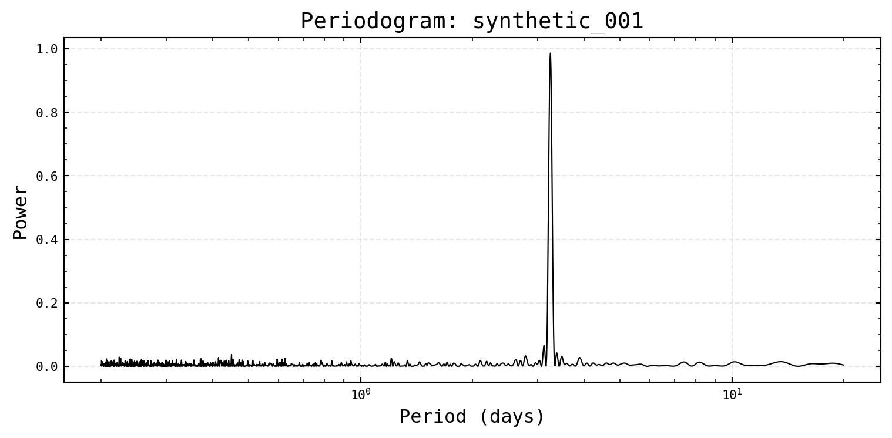

# Period Finding

`LightCurve` wraps four period-search backends. They all populate
`lc.periods` (candidates, strongest first) so downstream methods like
`plot_phased` can pick one up automatically.


```python
from varistar import TimeSeries, LightCurve
from _synthetic import make_sinusoidal_lightcurve

df = make_sinusoidal_lightcurve(period=3.2453)
ts = TimeSeries(magnitude="mag I", time_scale="HJD")
ts.load_data_from_df(df, data_id="synthetic_001")

lc = LightCurve(ts)
```

## Lomb-Scargle (default)


```python
lc.run_ls(min_freq=0.05, max_freq=5.0)
lc.plot_periodogram()
lc.periods[:3]
```



## Best-period selection

`find_best_period` runs Lomb-Scargle if needed, then checks for harmonic
aliasing and phase coverage before committing to one period:


```python
result = lc.find_best_period()
result
```

``` text
{'best_period': 3.246397593105865,
 'is_harmonic': False,
 'not_periodic': False,
 'not_dominant': False}
```

## Alternative backends

Useful when a light curve is strongly non-sinusoidal (e.g. eclipsing
binaries), where Lomb-Scargle can lock onto a harmonic instead of the
true period.


```python
# n_freq / n_bootstrap reduced from their defaults for faster docs builds
lc.run_pdm(min_freq=0.05, max_freq=5.0, n_freq=2000)
```

``` text
3.251728344855632
```


```python
lc.run_pdm2(min_freq=0.05, max_freq=5.0)
```

``` text
PDM2: 5851 trial frequencies...
```

``` text
6.490998218381418
```


```python
lc.run_sr(min_freq=0.05, max_freq=5.0, n_bootstrap=200)
```

``` text
Spectrum Resampling: running 200 bootstraps...
SR result: P = 3.24640 ± 0.00000 d
```

``` text
3.246397593105866
```

**Next:** [Phase Folding & Models](./phase-folding).
