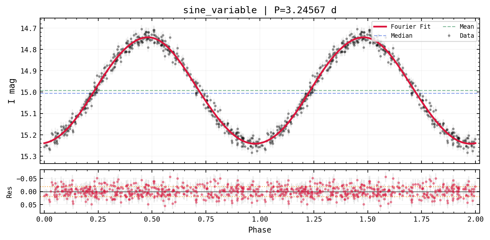
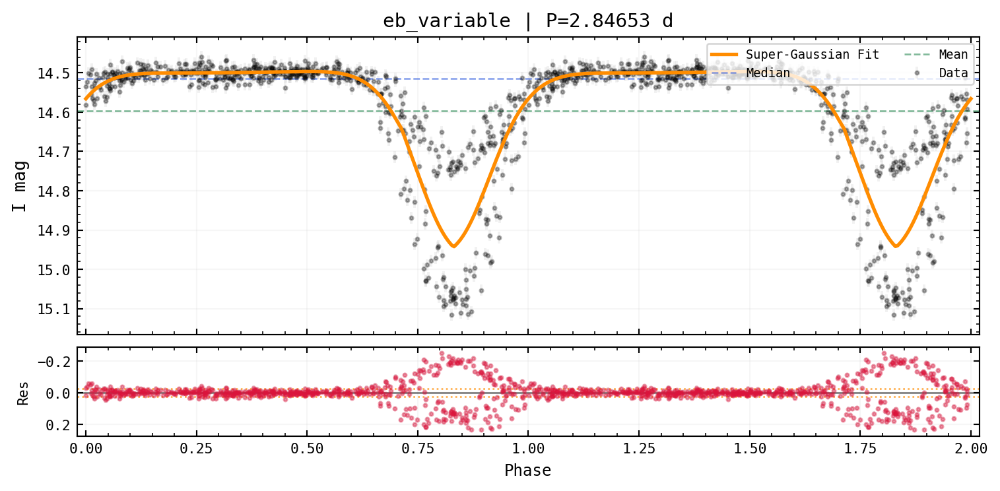
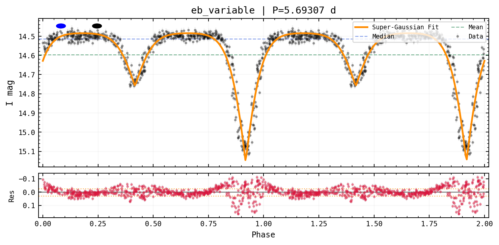

# Phase Folding & Model Fitting


```python
from varistar import TimeSeries, LightCurve
from _synthetic import make_sinusoidal_lightcurve, make_eclipsing_lightcurve
```

## Fourier fit (sinusoidal variables)


```python
ts_sine = TimeSeries(magnitude="mag I", time_scale="HJD")
ts_sine.load_data_from_df(make_sinusoidal_lightcurve(), data_id="sine_variable")

lc_sine = LightCurve(ts_sine)
lc_sine.plot_phased(fit_model="fourier", n_harmonics=4, show_residuals=True)
```



## Gaussian fit (eclipsing binaries)

The Double Super-Gaussian model handles the sharp, asymmetric dips a
Fourier series smooths over:


```python
ts_eb = TimeSeries(magnitude="mag I", time_scale="HJD")
ts_eb.load_data_from_df(make_eclipsing_lightcurve(), data_id="eb_variable")

lc_eb = LightCurve(ts_eb)
lc_eb.plot_phased(fit_model="gaussian", show_residuals=True)
```



## `plot_best`: one call, no guessing

`plot_best` finds the best period, runs the eclipsing-binary check, and
picks Fourier or Gaussian (doubling the period if that fits better)
automatically:


```python
lc_eb.plot_best()
```

``` text
[score_eb] Possible EB: eb_variable | ρ_dip=62.40  ρ_global=457.00
```



**Next:** [Classification](./classification).
